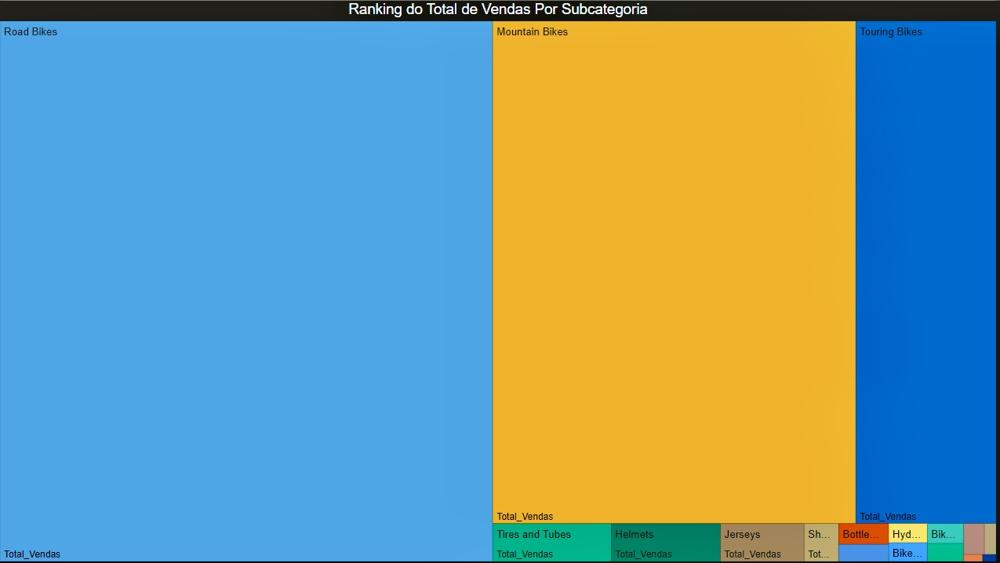
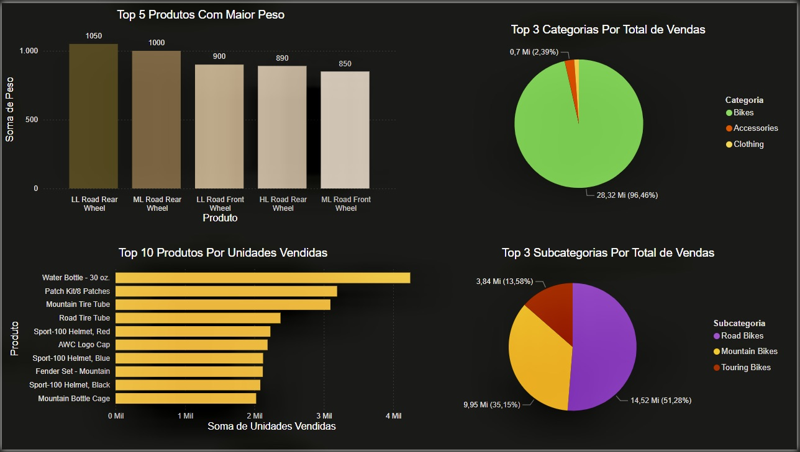
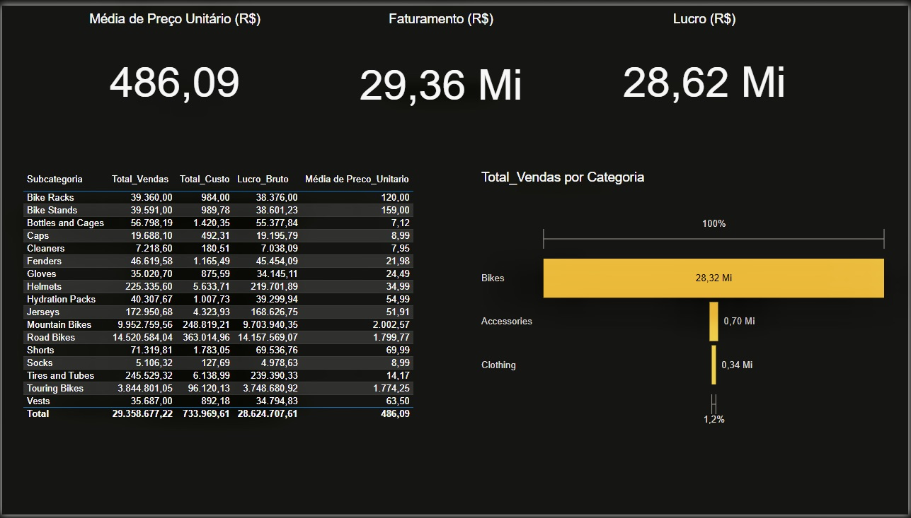
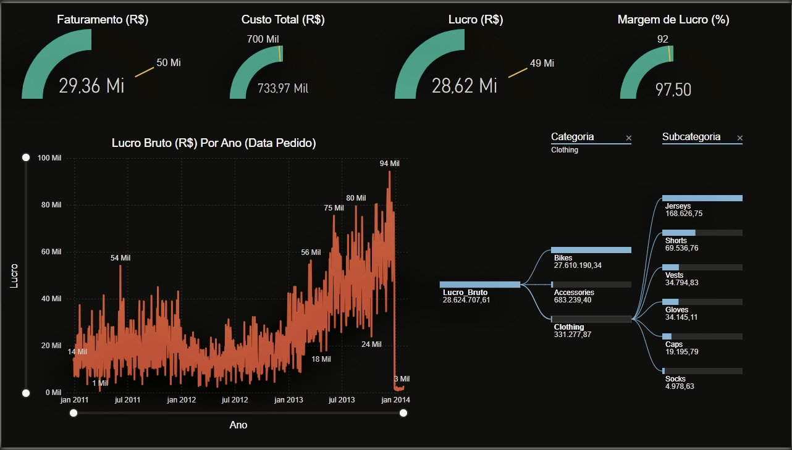

 # 💼 Power BI no Varejo: Desempenho Financeiro e Visualizações de KPIs

Este projeto simula o cenário de uma empresa do varejo multissetorial, com foco na análise financeira detalhada para embasar decisões estratégicas. A proposta é utilizar o **Power BI** como ferramenta principal para desenvolver relatórios interativos, visualizações eficazes e medidas **DAX** que ajudem a transformar dados brutos em insights valiosos.

---

## 📊 O que foi analisado?

Ao longo do projeto, foi possível analisar e acompanhar indicadores financeiros importantes entre **2011 e 2014**, incluindo:

- **Faturamento**
- **Custo total**
- **Lucro**
- **Margem de lucro**

Esses dados foram avaliados em diferentes níveis de detalhe, considerando categorias e subcategorias de produtos, mas também permitindo uma visão global da performance financeira da empresa ao longo do tempo.

Para os indicadores de **faturamento, custo total e lucro**, foram incluídas **barras amarelas representando metas (KPIs)**, destacando visualmente os valores que deveriam ser alcançados, o que facilita a avaliação de desempenho em relação aos objetivos estabelecidos.

---

## 🧩 Estrutura do Projeto

O projeto está dividido em **cinco cenários distintos**, cada um com um desafio específico de análise. Em cada cenário, os dados são explorados de forma adequada e os resultados apresentados de maneira clara e acessível aos tomadores de decisão.

Essa abordagem permite exercitar a análise de dados aplicada a situações reais de negócios, sempre respeitando boas práticas de modelagem e visualização no Power BI.

# 📌 Cenário 1– Ranking do Total de Vendas por Subcategoria (Visual Treemap)

Neste cenário, é apresentado o ranking do total de vendas por subcategoria utilizando o visual **Treemap**. 

O Treemap é uma visualização que organiza dados hierárquicos em retângulos proporcionais ao valor de cada categoria, facilitando a identificação rápida das subcategorias que mais contribuem para as vendas, de forma intuitiva e visualmente impactante.

# 📌 Cenário 2 – Análise de Produtos e Categorias com Maior Relevância

Neste cenário, o foco é identificar os produtos e categorias que mais impactam as vendas da empresa. As análises incluem:

- **Top 5 produtos com maior peso (kg):** produtos mais relevantes em volume físico comercializado.
- **Top 10 produtos por unidades vendidas:** itens com maior giro, indicando popularidade e demanda.
- **Top 3 categorias por total de vendas (R$):** segmentos que mais contribuem para o faturamento.
- **Top 3 subcategorias por total de vendas (R$):** análise detalhada das subcategorias mais lucrativas.

Essas visualizações fornecem uma base sólida para decisões de estoque, marketing e precificação.

# 📌 Cenário 3 – Seleção Dinâmica com Botão de Rolar no Power BI

Neste cenário, foi utilizado um botão de rolar que lista os nomes dos produtos.  
Ao selecionar um produto específico (exemplo: *Classic Vest, M*), são exibidos:  
- O total de quantidade vendida desse produto.  
- Os anos com maior volume de vendas (no exemplo, 2013 foi o ano de maior venda).

Essa funcionalidade permite uma análise detalhada e dinâmica de cada produto.

# 📌 Cenário 4 -  Informações Complementares

Na parte superior do relatório, são exibidos indicadores-chave:

- **Média de preço unitário**
- **Faturamento total**
- **Lucro total**

Abaixo, há uma **tabela detalhada** com as seguintes informações por subcategoria:

- Total de vendas  
- Total de custo  
- Lucro bruto  
- Média de preço unitário

Ao lado, um **gráfico de funil** apresenta o total de vendas por categoria, oferecendo uma visualização mais clara e interativa do desempenho por segmento.

# 📌 Cenário 5 – Análise de Desempenho com KPIs e Hierarquia de Vendas

Este dashboard apresenta novamente os principais indicadores:

- **Faturamento**
- **Custo total**
- **Lucro**
- **Margem de lucro**

Desta vez, os dados são apresentados como **KPIs** com barras de desempenho (DPI) que indicam, por meio de uma barra amarela, as metas estabelecidas e se foram ou não alcançadas.

Na parte inferior do relatório:

- Um **gráfico de linhas** mostra a evolução do **lucro bruto por ano**.  
- Ao lado, uma **árvore hierárquica** detalha as subcategorias da categoria *Roupa*, destacando as que tiveram maior volume de vendas.

